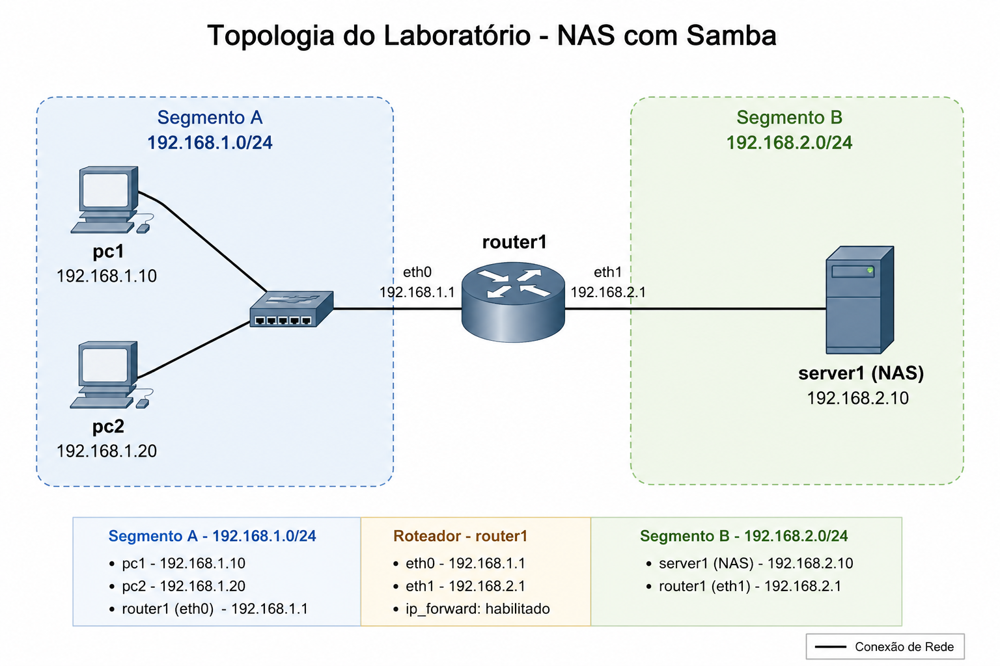

# Laboratório de NAS com Samba utilizando Kathará

Este laboratório apresenta uma topologia simples composta por:

* dois clientes Linux
* um roteador Linux
* um servidor NAS baseado em Samba

O objetivo é demonstrar como:

* criar múltiplas sub-redes IP
* conectar redes através de um roteador Linux
* utilizar containers Docker personalizados no Kathará
* implementar um servidor NAS utilizando Samba
* compartilhar arquivos através do protocolo SMB
* automatizar clientes e servidores com scripts shell
* registrar logs distribuídos em um compartilhamento centralizado

Durante o laboratório são explorados conceitos importantes de:

* roteamento IP
* gateway padrão
* encaminhamento de pacotes (`ip_forward`)
* permissões Linux
* compartilhamento SMB
* automação com Bash
* integração entre Docker e Kathará

---

# Topologia

A rede é composta por dois segmentos conectados por um roteador.

## Segmento A

* pc1
* pc2
* router1

## Segmento B

* router1
* server1

---

# Estrutura do laboratório

```text
pc1[0]="A"
pc1[image]="meu-smbclient"

pc2[0]="A"
pc2[image]="meu-smbclient"

router1[0]="A"
router1[1]="B"

server1[0]="B"
server1[image]="dperson/samba"
```

---

# Endereçamento da rede

## Rede 192.168.1.0/24

| Host    | Interface | Endereço     |
| ------- | --------- | ------------ |
| router1 | eth0      | 192.168.1.1  |
| pc1     | eth0      | 192.168.1.10 |
| pc2     | eth0      | 192.168.1.20 |

---

## Rede 192.168.2.0/24

| Host    | Interface | Endereço     |
| ------- | --------- | ------------ |
| router1 | eth1      | 192.168.2.1  |
| server1 | eth0      | 192.168.2.10 |

O roteador conecta as duas redes e permite comunicação entre os clientes e o servidor NAS.

---

# Tecnologias utilizadas

Este laboratório utiliza ferramentas comuns do ecossistema Linux:

* Kathará para emulação de redes
* Containers Docker como hosts da topologia
* Samba para compartilhamento SMB
* Docker para criação de imagens customizadas
* Bash scripting para automação
* Linux networking tools (`ip`)
* SMB/CIFS para compartilhamento de arquivos

---

# Imagem Docker do servidor Samba

Foi utilizada a imagem pronta:

```bash
docker pull dperson/samba
```

A imagem foi utilizada diretamente no `server1` para disponibilizar o serviço SMB dentro do laboratório.

---

# Construção da imagem cliente SMB

Foi criada uma imagem mínima Debian contendo ferramentas de rede e o cliente SMB.

## Criar diretório do projeto

```bash
mkdir ~/smbclient-image
cd ~/smbclient-image
```

---

## Criar Dockerfile

```Dockerfile
FROM debian:stable-slim

RUN apt update && \
    apt install -y \
    smbclient \
    cifs-utils \
    iproute2 \
    iputils-ping \
    netcat-openbsd \
    tcpdump && \
    apt clean

CMD ["/bin/bash"]
```

---

## Construir imagem

```bash
docker build -t meu-smbclient .
```

---

## Verificar imagens locais

```bash
docker images
```

A imagem criada foi utilizada como base para os clientes `pc1` e `pc2`, permitindo acesso ao servidor SMB através do comando `smbclient`.

---

# Configuração do servidor NAS

O servidor NAS recebe:

* endereço IP estático
* gateway padrão
* configuração automática do compartilhamento
* permissões de escrita no diretório compartilhado
* registro de inicialização do ambiente

O compartilhamento SMB é disponibilizado através do diretório `/share`.

---

# Configuração do roteador

O roteador Linux realiza o encaminhamento de pacotes entre as duas redes utilizando `ip_forward`.

As interfaces recebem endereços IP estáticos para permitir comunicação entre os segmentos da topologia.

---

# Automação dos clientes

Foi criado um script responsável por:

* gerar logs locais nos clientes
* enviar os arquivos de log para o servidor NAS via SMB
* verificar os arquivos disponíveis no compartilhamento

O objetivo é demonstrar automação simples de clientes Linux utilizando o protocolo SMB e o comando `smbclient`.

---

# Leitura dos logs

Também foi criado um script para:

* acessar o diretório compartilhado do servidor NAS
* consultar os logs gerados pelos clientes
* visualizar os registros de inicialização e acesso do ambiente

Esse processo demonstra a centralização de informações em um servidor de arquivos compartilhado.

---

# Resultados observados

Durante os testes foi possível observar:

* conectividade entre sub-redes
* funcionamento do gateway padrão
* roteamento entre segmentos
* compartilhamento de arquivos SMB
* autenticação guest no Samba
* upload e leitura de arquivos remotos
* automação de tarefas utilizando Bash
* integração entre containers Docker e Kathará

O laboratório resultou em um pequeno ambiente NAS totalmente funcional e automatizado utilizando exclusivamente ferramentas Linux.

