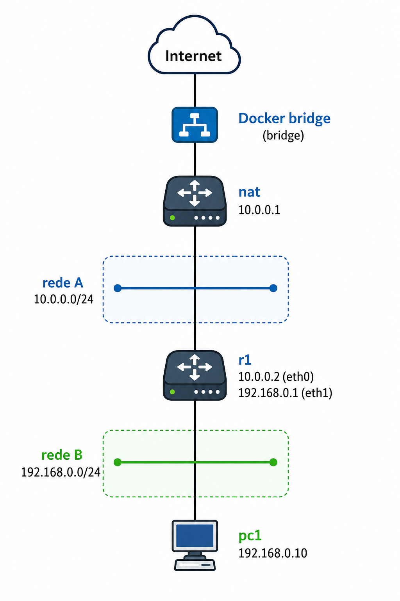

# Lab 7 — Acesso à Internet Real no Kathará usando NAT manual

Este laboratório demonstra como fornecer acesso à internet real para uma topologia virtual no Kathará utilizando um container Linux atuando como roteador NAT manual.

O objetivo é permitir que hosts internos da topologia virtual acessem a internet através de um container NAT conectado simultaneamente:

* à rede interna do laboratório
* à bridge padrão do Docker

---

# Objetivo do laboratório

Implementar o seguinte fluxo de conectividade:

pc1 -> r1 -> nat -> Docker bridge -> internet

Onde:

* `pc1` representa um host da LAN
* `r1` atua como roteador interno
* `nat` atua como roteador de borda/NAT
* a bridge do Docker fornece acesso externo à internet real

---


# Habilitando Docker Bridge no Docker Desktop

Antes de iniciar o laboratório:

1. Abrir Docker Desktop
2. Acessar:

`Settings -> Resources -> Network`

3. Habilitar:

`Enable host networking`

4. Reiniciar o Docker Desktop

---

# Função de cada dispositivo

## nat

O container `nat` funciona como roteador de borda.

Responsabilidades:

* conexão com a bridge do Docker
* NAT/Masquerade
* saída para internet
* rota estática para rede interna

---

## r1

O `r1` atua como roteador interno entre:

* rede A (uplink/WAN)
* rede B (LAN)

Responsabilidades:

* roteamento entre redes
* gateway da LAN
* encaminhamento de pacotes

---

## pc1

Host cliente da LAN.

Responsabilidades:

* utilizar `r1` como gateway padrão
* acessar internet através da cadeia de roteamento

---

# Automatizando a conexão da bridge Docker

O container `nat` precisa ser conectado manualmente à bridge padrão do Docker para receber acesso externo à internet.

Para automatizar esse processo, foi criado um script Bash responsável por:

1. iniciar o laboratório
2. localizar dinamicamente o container `nat`
3. conectar o container à bridge Docker

---

# Explicação do pipeline Bash

O trecho abaixo localiza automaticamente o ID do container NAT:

```bash
docker ps --format "{{.ID}} {{.Names}}" | grep "nat" | awk '{print $1}'
```

Funcionamento:

| Comando                         | Função                  |
| ------------------------------- | ----------------------- |
| `docker ps`                     | lista containers ativos |
| `--format "{{.ID}} {{.Names}}"` | exibe apenas ID e nome  |
| `grep "nat"`                    | filtra o container NAT  |
| `awk '{print $1}'`              | extrai somente o ID     |

O resultado é armazenado na variável:

`CONTAINER`

e utilizado no comando:

```bash
docker network connect bridge "$CONTAINER"
```

que conecta o container NAT à bridge padrão do Docker.

---

# Testes de conectividade

O laboratório inclui um script simples para validar rapidamente a conectividade entre o dispositivo final, os roteadores intermediários e também o acesso à internet, realizando testes de ping para:

* `r1`
* `nat`
* Google DNS (`8.8.8.8`)

---

# Resultado final

O laboratório implementa uma arquitetura clássica de roteamento:

LAN -> roteador interno -> roteador NAT -> internet

demonstrando:

* roteamento entre redes
* NAT Linux com iptables
* integração entre Kathará e Docker
* acesso à internet real em laboratório virtual
* automação de provisioning usando Bash

